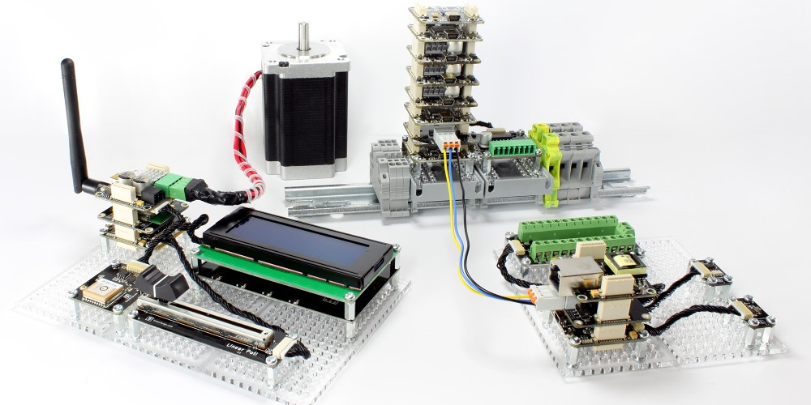

# TINKERFORGE SENSOR API




### Description
This project is an example to get a feeling how the world of smart home works.
From putting sensors together up to programming the logic/behavior.

### Requirements
* Tinkerforge Elements (https://www.tinkerforge.com)
* Tinkerforge Brick Daemon (https://www.tinkerforge.com/en/doc/Software/Brickd.html#brickd)
* IntelliJ IDEA for programming (https://www.jetbrains.com/idea/download/)
* Java 8 or higher
* Maven

### Hackerschool Helper
* of curse there are some helping methods for faster programming and don't thinking about it.
#### timePassed(milliseconds)
* Will return true if the last call at this lime has passed the time
```java
if(timePassed(1000)) {
    console("You were waiting long engouh");
} else {
    console("You still have to wait for it")
}
```

#### timePassed(textLabel, milliseconds)
* Will return true if the last call with this label has passed the time
```java
if("program 2", timePassed(1000)) {
    console("You were waiting long engouh");
} else {
    console("You still have to wait for it")
}
```

#### isEmpty(text)
* Will return true if text is null or empty otherwise false
```java
if(isEmpty("not empty text")) {
    console("This ist an empty text");
} else {
    console("This text is not empty")
}
```
* result: "This text is not empty"
#### console(text)
* print message to the console (including java.lang.String.format)
```java
console("Write something")
```
* result: "18.05.19 11:22:33 Write something"

#### error(text)
* same as console just with error (red line)

#### async(textLabel, run -> myFunction)
* Will start a program in a new thread/async/parallel 
```java
loop("my program 5", run -> myFunction())
myFunction() {
    console("my async program")
}
```

#### loop(textLabel, run -> myFunction)
* Will start and loop a program in a new thread thread/async/parallel 
```java
loop("my program 3", run -> myFunction())
myFunction() {
    console("Endless message")
}
```

#### loop(textLabel, run -> myFunction, 10)
* Will start and loop a program in a new thread thread/async/parallel 
```java
loop("my program 4", run -> myFunction(), 10)
myFunction() {
    console("message will be processed 10 times")
}
```

#### roundUp(value)
* Will round up and cut the number of decimal values to two  
```java
roundUp(1.55555555, run -> myFunction())
* result: 1.56
```

#### roundUp(value, decimals)
* Will round up and cut the number of the decimal values to the given ones  
```java
roundUp(1.55555555, run -> myFunction(), 4)
* result: 1.5556
```

#### sleep(millisecond)
* Will wait for the given milliseconds  
```java
sleep(1000)
* result: wait 1 Second
```

#### date()
* print returns a text including the current date
```java
String date = date()
```
* result: "18.05.19"

#### time()
* print returns a text including the current time
```java
String time = date()
```
* result: "11:22:33"

#### dateTime()
* print returns a text including the current date and time
```java
String date = date()
```
* result: "18.05.19 11:22:33"